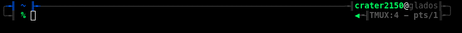
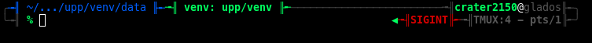
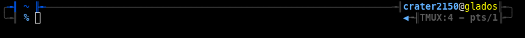
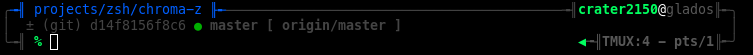
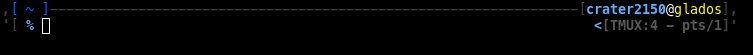

# chroma-z - multiline prompt theme for zsh

A multiline prompt theme for zsh, that can display various info without changing
where the cursor starts.



Can display Virtualenv/Conda environment and exit code of last command:


Changes color when in an SSH session or when the user is root:


In directories with a versioning system, info about the state is shown in an
extra line:


When using an older terminal, you can set `PROMPT_UNICODE=no` to change to a
ascii-only variant:


## Custom Prompt Elements

You can add custom prompt elements, which will be styled similar to the
virtualenv display (see above). For each custom element, add a function to
`__chromaz_extra_left`. It will be called and if its output isn't empty, a
prompt element with the output will be added.

Example: show number of open todos (assuming `todo` outputs a list of todos):

```
_prompt_todos() { local todos=$(todo | wc -l); [[ $todos -gt 0 ]] && echo "Todos: $todos" }
__chromaz_extra_left+=_prompt_todos
```
